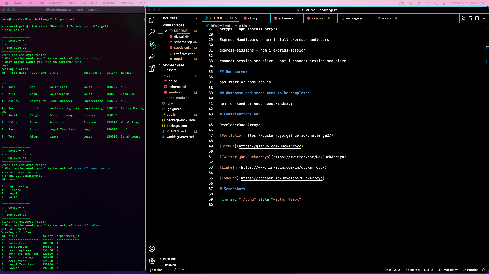
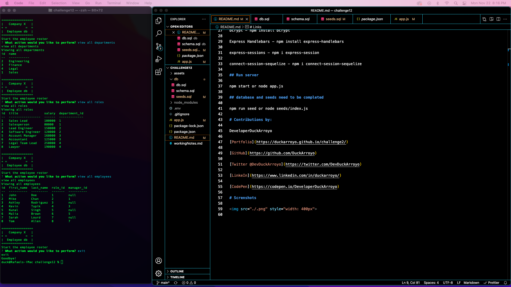

# challenge12

# UO Coding bootcamp Employee Tracker

# Links

[Walkthrough Video](https://watch.screencastify.com/v/4Vkl5OBpfzXkco7qfKSk)

[Github Repository](https://github.com/DuckArroyo/employeedb)

# Description

This is a sql project to manage an employee database.

## Required installations for code duplication

npm - npm install

express - npm install express
sequelize - npm install sequelize
mysql2 - npm install mysql2

.env - npm install dotenv

bcrypt - npm install bcrypt

Express Handlebars - npm install express-handlebars

express-sessions - npm i express-session

connect-session-sequelize - npm i connect-session-sequelize

## Run server

npm start or node app.js

## database and seeds need to be completed

npm run seed or node seeds/index.js

# Contributions by:

DeveloperDuckArroyo

[Email](mailto:DeveloperDuckArroyo@gmail.com)

[Portfolio](https://github.com/DuckArroyo/portfolio)

[React Portfolio](http://DuckArroyo.github.io/reactPortfolio)

[GitHub](https://github.com/DuckArroyo)

[Twitter @DevDuckArroyo](https://twitter.com/DevDuckArroyo)

[LinkedIn](https://www.linkedin.com/in/duckarroyo)

[CodePen](https://codepen.io/DeveloperDuckArroyo)

# Screnshots

